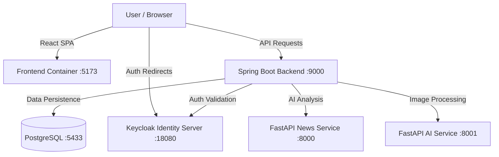
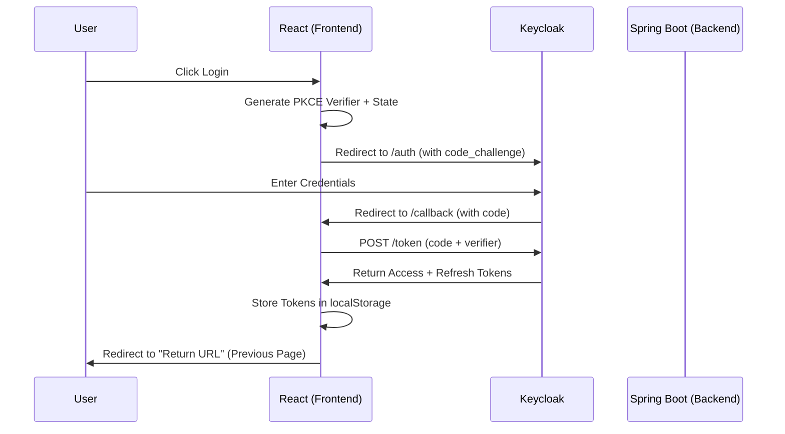
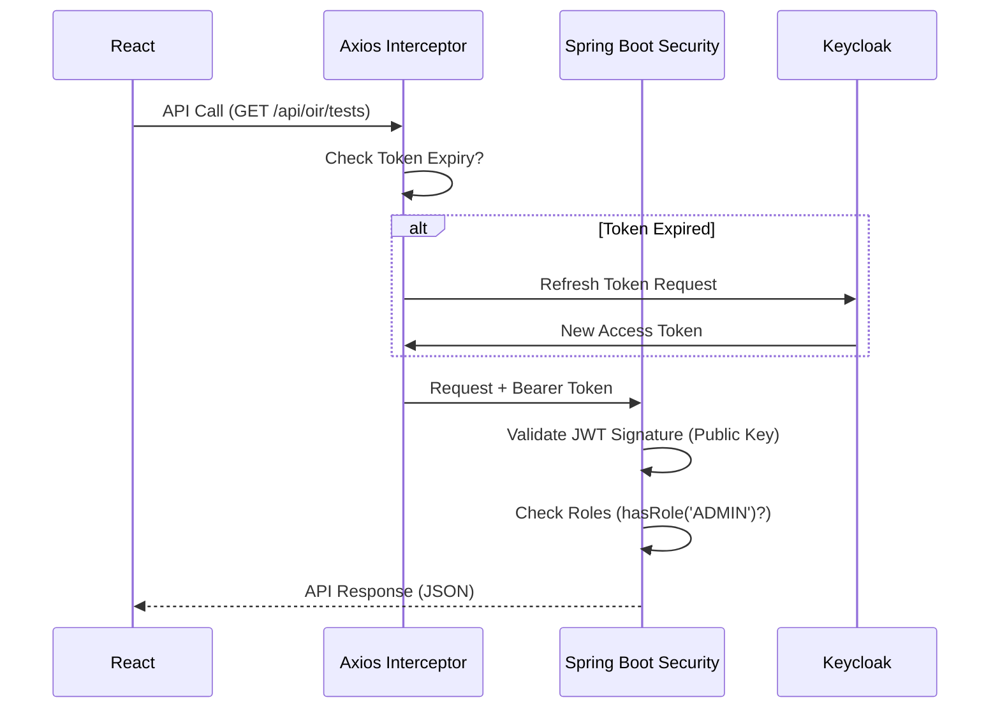

# 🦅 SSB Prep AI - Project Architecture & Flow

> **📚 Full Documentation:** [View Complete Project Documentation](./PROJECT_DOCUMENTATION.md) — *Detailed Tech Stack, Database Schema (ERD), API Endpoints, and Setup Guide.*

This document outlines the architecture, data flow, and security implementation of the SSB Prep AI platform.

## 🏗️ High-Level Architecture

The project follows a **Microservices-lite Architecture** using Docker Compose:



---

## 🔐 Authentication & Security Flow

We use **OAuth 2.0 with PKCE (Proof Key for Code Exchange)** for maximum frontend security.

### 🔄 Login Flow Diagram



### 🛡️ API Request Flow (Security)



**Security Features Implemented:**
- **CSP Headers:** Blocks external scripts (XSS protection).
- **PKCE:** Prevents authorization code interception.
- **State Parameter:** Prevents CSRF attacks.
- **Return URL:** Remembers user's location across login.

---

## 📂 Frontend ↔ Backend API Mapping

Here is how the Frontend connects to the Backend services.

### 1. 🧠 OIR (Officer Intelligence Rating)

| Frontend Page | API Logic File | Backend Controller | Database Table |
|---------------|----------------|--------------------|----------------|
| `/oir` (List) | `Front/src/lib/api.js` | `OirController.java` | `oir_tests` |
| `/oir/admin` (Create) | `Front/src/lib/api.js` | `OirAdminController.java` | `oir_tests`, `oir_questions` |

**Flow:**
`OirPage.jsx` → `useQuery` → `api.get("/api/oir/tests")` → `OirController.getAllTests()` → `DB`

### 2. 📝 PPDT (Picture Perception)

| Frontend Component | API Method | Backend Controller | AI Service |
|--------------------|------------|--------------------|------------|
| `SamplePPDT.jsx` | `getPpdtStories()` | `PpdtController.java` | - |
| `AddPPDTImage.jsx` | `uploadImage()` | `PpdtAdminController.java` | - |
| `PPDTTest.jsx` | `analyzeStory()` | `AnalysisController.java` | `FastAPI (Port 8001)` |

**AI Flow:**
User submits story → Spring Boot receives text → Forwarded to `FastAPI:8001/analyze` → AI Result returned to Frontend.

### 3. 📰 News & Current Affairs

| Frontend Component | Backend Service | Port |
|--------------------|-----------------|------|
| `News.jsx` | FastAPI News Service | `:8000` |

---

## 📁 Project Structure Guide

### **Frontend (`/Front`)**

| Directory | Purpose | Key Files |
|-----------|---------|-----------|
| `src/lib` | **Core Logic** | `api.js` (Axios), `authApi.js` (Auth), `AuthContext.jsx` |
| `src/pages` | **Views** | `PPDTTest.jsx`, `OirPage.jsx`, `Index.jsx` |
| `src/components`| **UI Parts** | `Header.jsx`, `Footer.jsx`, `LoadingSpinner.jsx` |

### **Backend (`/PPDT`)**

| Package | Purpose | Key Files |
|---------|---------|-----------|
| `com.example.ssb.security` | **Security Config** | `SecurityConfig.java`, `SecurityHeadersConfig.java` |
| `com.example.ssb.oir` | **OIR Domain** | `OirController.java`, `OirService.java` |
| `com.example.ssb.ppdt` | **PPDT Domain** | `PpdtController.java`, `PpdtService.java` |

---

## 🛠️ How to Run

1. **Security & Configuration Setup** (Crucial!)
   - **Environment Variables**: Copy `.env.example` to `.env` and fill in your secrets.
     ```sh
     cp .env.example .env
     ```
   - **Keycloak Realm Config**: Copy the example config to the actual config file.
     ```sh
     cp docker-services/realm-config.example.json docker-services/realm-config.json
     ```
     > **Note:** `docker-services/realm-config.json` is git-ignored to protect secrets. You must create it locally.

2. **Start Services (Docker)**
   ```sh
   docker-compose up -d
   ```
   *Starts: Postgres, Keycloak, FastAPI Services*

3. **Start Backend (Spring Boot)**
   ```sh
   cd PPDT
   ./mvnw spring-boot:run
   ```

4. **Start Frontend (React)**
   ```sh
   cd Front
   npm run dev
   ```
