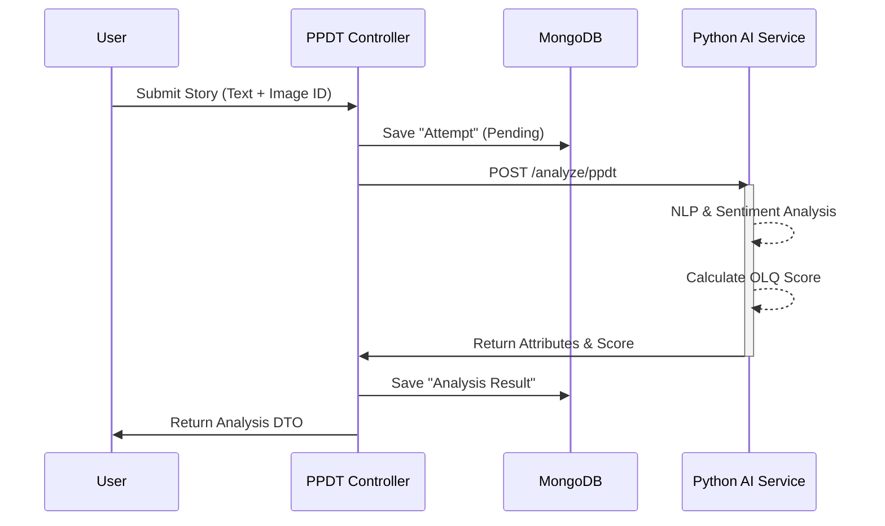

# 🇮🇳 SSB Preparation Platform - Backend

## 📖 Overview
A robust, microservices-based backend powering the **SSB (Services Selection Board)** preparation platform. This system facilitates:
*   **PPDT (Picture Perception & Description Test)** with AI-powered story analysis.
*   **Defense News Aggregation** from multiple sources.
*   **GTO (Group Testing Officer)** task management.

## 🛠️ Tech Stack

### Core
*   **Language**: Java 17
*   **Framework**: Spring Boot 3.2
*   **Build Tool**: Maven

### Microservices (AI & Data)
*   **Language**: Python 3.10+
*   **Framework**: FastAPI
*   **Services**:
    *   `Analyse`: AI logic for scoring PPDT stories.
    *   `News Section`: Aggregates defense news from RSS feeds.

### Infrastructure & Data
*   **Database (Relational)**: PostgreSQL (User data)
*   **Database (NoSQL)**: MongoDB Atlas (PPDT scenarios, unstructured data)
*   **Authentication**: Supabase (Requests & Auth)
*   **Media**: Cloudinary (Image storage)

---

## 🏗️ System Architecture

```mermaid
graph TD
    subgraph Client
        UI[React Frontend]
    end

    subgraph "API Gateway / Auth"
        SUPA[Supabase Auth]
        SB[Spring Boot Backend]
    end

    subgraph "Microservices Cluster"
        NEWS[News Service (FastAPI)]
        AI[AI Analysis Service (FastAPI)]
    end

    subgraph "Data Persistence"
        PG[(PostgreSQL)]
        MONGO[(MongoDB Atlas)]
        CLOUD[Cloudinary]
    end

    %% Flows
    UI -->|Bearer Token| SB
    UI -.->|Auth / Login| SUPA
    SB <-->|Validate JWT| SUPA

    SB <-->|User/Admin Data| PG
    SB <-->|Stories & Metadata| MONGO
    SB -->|Fetch Images| CLOUD

    SB -->|Get News| NEWS
    SB -->|Analyze Story| AI
```

---

## 🔄 Core Flow: PPDT Story Analysis

1.  User views a hazy image (stored in Cloudinary).
2.  User types a story within 4 minutes.
3.  Spring Boot sends the story text + image context to the Python AI Service.
4.  AI evaluates perception, logic, and "Officer Like Qualities" (OLQ).
5.  Result is saved to MongoDB and returned to the user.



---

## 🚀 Setup & Installation

### 1. Prerequisites
*   Java 17+
*   Python 3.10+
*   Docker (for PostgreSQL)
*   MongoDB Atlas Account
*   Supabase Account

### 2. Environment Variables
Create a `.env` file in the root directory (or ensure your environment has these keys):

```properties
# Database
POSTGRES_USER=postgres
POSTGRES_PASSWORD=your_password
POSTGRES_DB=ppdtcore
MONGO_URI=mongodb+srv://...

# Authentication (Supabase)
SUPABASE_URL=https://your-project.supabase.co
SUPABASE_KEY=your_anon_key
# The issuer URI is usually: https://<project-ref>.supabase.co/auth/v1
KEYCLOAK_ISSUER_URI=https://<project-ref>.supabase.co/auth/v1

# Cloudinary
CLOUDINARY_CLOUD_NAME=your_cloud_name
CLOUDINARY_API_KEY=your_api_key
CLOUDINARY_API_SECRET=your_api_secret

# Microservices URLs
NEWS_SERVICE_URL=http://localhost:8000/news
ANALYSE_SERVICE_URL=http://localhost:8001/analyze/ppdt
```

### 3. Running the Services

#### Step 1: Start Infrastructure (Docker)
```bash
# Start Postgres
docker-compose up -d postgres
```

#### Step 2: Start Microservices
**News Service**:
```bash
cd news-service
pip install -r requirements.txt
uvicorn main:app --reload --port 8000
```

**Analysis Service**:
```bash
cd Analyse
pip install -r requirements.txt
uvicorn main:app --reload --port 8001
```

#### Step 3: Start Main Backend
```bash
cd PPDT
./mvnw spring-boot:run
```

The backend will start on **Port 9000**.

---

## 🔌 API Endpoints (Snapshot)

| Method | Endpoint | Description |
| :--- | :--- | :--- |
| **PPDT** | | |
| `POST` | `/ppdt/submit` | Submit a story for AI analysis |
| `GET` | `/ppdt/samples` | Get sample images for practice |
| **GTO** | | |
| `GET` | `/gto/lecturette` | List all lecturette topics |
| `POST` | `/gto/lecturette` | Add a new topic (Admin only) |
| **News** | | |
| `GET` | `/news` | Get aggregated defense news |
